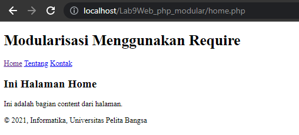
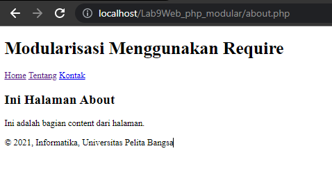
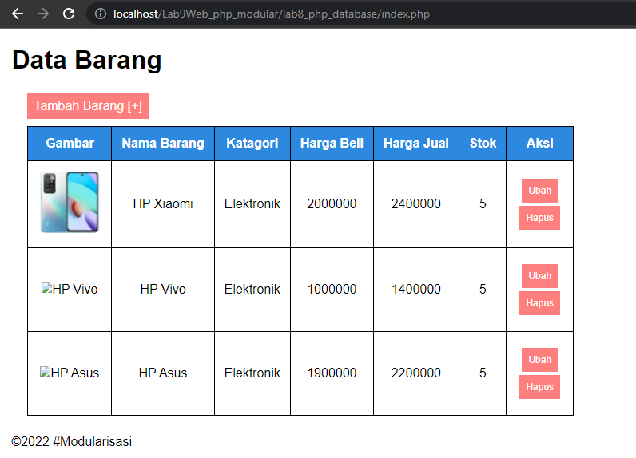
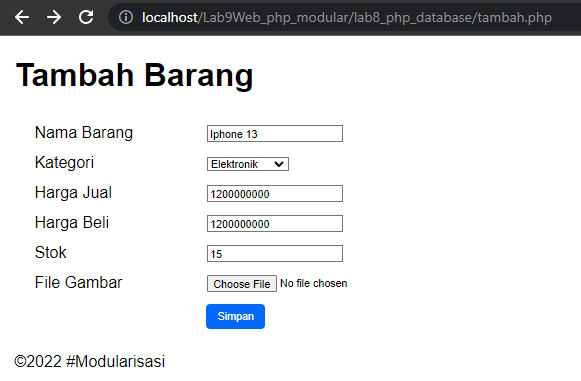
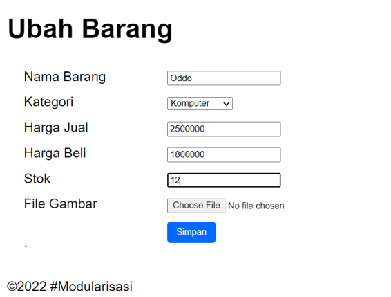

# LAB9 PHP Modular

<table border="2" cellpading="10">
  <tr>
    <td><b>Nama</b></td>
    <td>Fahmi Eko Putro Santoso</td>
  </tr>
  <tr>
    <td><b>NIM</b></td>
    <td>312010046</td>
  </tr>
  <tr>
    <td><b>Kelas</b></td>
    <td>TI.20.A1</td>
  </tr>
  <tr>
    <td><b>MataKuliah</b></td>
    <td>Pemrograman Web</td>
  </tr>
</table>

# <b>Praktikum</b>

## <b>1. Membuat header.php </b>
- Berikut adalah kodenya,
```html
<!DOCTYPE html>
<html lang="en">
    <head>
        <meta charset="UTF-8">
        <title>Contoh Modularisasi</title>
        <link href="style.css" rel="stylesheet" type="text/stylesheet" media="screen" />
    </head>
    <body>
        <div class="container">
            <header>
                <h1>Modularisasi Menggunakan Require</h1>
            </header>
            <nav>
                <a href="home.php">Home</a>
                <a href="about.php">Tentang</a>
                <a href="kontak.php">Kontak</a>
            </nav>
```

## <b>2. Membuat footer.php </b>
- Berikut adalah kodenya,
```html
<footer>
                <p>&copy; 2021, Informatika, Universitas Pelita Bangsa</p>
            </footer>
        </div>
    </body>
</html>
```

## <b>3. Memuat home.php </b>
- Berikut adalah kodenya,
```php
<?php require('header.php'); ?>

<div class="content">
    <h2>Ini Halaman Home</h2>
    <p>Ini adalah bagian content dari halaman.</p>
</div>

<?php require('footer.php'); ?>
```
- Tampilannya,


## <b>4. Memuat about.php </b>
- Berikut adalah kodenya,
```php
<?php require('header.php'); ?>

<div class="content">
    <h2>Ini Halaman About</h2>
    <p>Ini adalah bagian content dari halaman.</p>
</div>

<?php require('footer.php'); ?>
```
- Tampilannya,


# Tugas
<b> 1. Implementasikan konsep modularisasi pada kode program praktikum 8 tentang database, sehingga setiap halamannya memiliki template tampilan yang sama</b>

Jawaban:

- Header, dengan kode program
```html
<!DOCTYPE html>
<html lang="en">
    <head>
        <meta charset="UTF-8">
        <link href="css/styles.css" rel="stylesheet" type="text/css" />
        <title>Data Barang</title>
    </head>
    <body>
        <div class="container">
            <h1 class="header">Data Barang</h1>
```

- Main, dengan kode program
```html
            <div class="main">
                <a href="tambah.php" class="add-item">Tambah Barang [+]</a>
                <table>
                    <tr>
                        <th>Gambar</th>
                        <th>Nama Barang</th>
                        <th>Katagori</th>
                        <th>Harga Beli</th>
                        <th>Harga Jual</th>
                        <th>Stok</th>
                        <th>Aksi</th>
                    </tr>
                    <?php if($result): ?>
                    <?php while($row = mysqli_fetch_array($result)): ?>
                    <tr>
                        <td>" alt="<?=
                        $row['nama'];?>" width="100" height="100"></td>
                        <td><?= $row['nama'];?></td>
                        <td><?= $row['kategori'];?></td>
                        <td><?= $row['harga_beli'];?></td>
                        <td><?= $row['harga_jual'];?></td>
                        <td><?= $row['stok'];?></td>
                        <td>
                            <p class="action"><a href="ubah.php?id=<?= $row['id_barang'];?>">Ubah</a></p>
                            <p class="action"><a href="config/hapus.php?id=<?= $row['id_barang'];?>">Hapus</a></p>
                            <p hidden><?= $row['id_barang'];?></hidden>
                        </td>
                    </tr>
                    <?php endwhile; else: ?>
                    <tr>
                        <td colspan="7">Belum ada data</td>
                    </tr>
                    <?php endif; ?>
                </table>
            </div>
```

- Footer, dengan kode program
```html
            <footer>
                <p>&copy;2022 #Modularisasi</p>
            </footer>
        </div>
    </body>
</html>
```

- Tampilan index.php, dengan struktur header main footer


- Tampilan tambah.php, dengan tambahan layout footer.php


- Tampilan ubah.php, dengan tambahan layout footer.php
